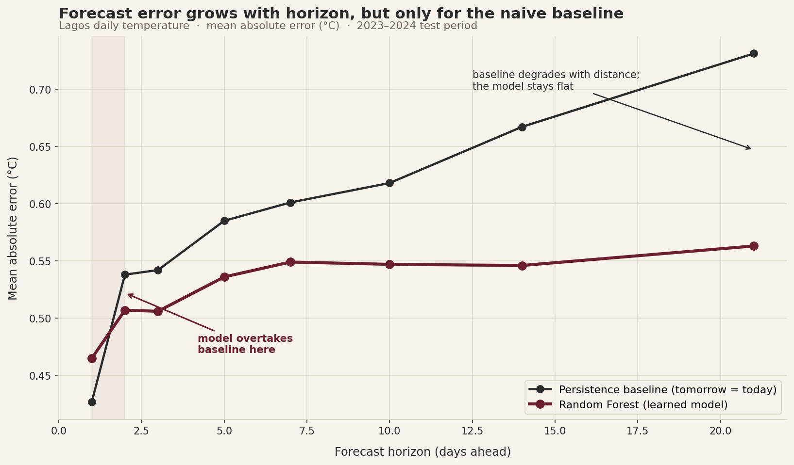

# Forecasting Lagos Temperature

Time-series forecasting on ten years of open weather data, showing where a learned model beats a naive baseline and where it does not.

## TL;DR

A persistence baseline ("tomorrow equals today") is very hard to beat for next-day temperature in Lagos. But as the forecast horizon grows, persistence degrades while a Random Forest using seasonal and trend features stays accurate. The learned model's advantage is negligible at 1 day and grows with every day of horizon.

| Horizon | Baseline MAE (°C) | Model MAE (°C) |
|---|---|---|
| 1 day | 0.43 | 0.47 |
| 3 days | 0.54 | 0.51 |
| 7 days | 0.60 | 0.55 |
| 14 days | 0.67 | 0.55 |
| 21 days | 0.73 | 0.56 |

## The Idea

To forecast the future from the past, predictive features are engineered from prior values: lagged temperatures, a rolling 7-day average, and calendar features for seasonality. The target is the temperature N days ahead. The data is split by time (train on 2015 to 2022, test on 2023 to 2024) rather than randomly, which mirrors real deployment and avoids data leakage.

## Data

Ten years of hourly Lagos weather from the Open-Meteo historical archive API (free, no key, no missing values), aggregated to daily averages. Open-Meteo's open access let the work focus on modeling rather than data collection.

## Method

1. **Baseline (persistence):** predict that the future value equals today's.
2. **Model (Random Forest):** trained on lag, rolling, and calendar features.
3. Evaluated with mean absolute error across forecast horizons from 1 to 21 days.

## Key Finding

The value of a learned model depends on horizon. At 1 day, persistence wins (today is an excellent predictor of tomorrow). Beyond 2 days, the model overtakes the baseline, and the gap widens steadily out to 21 days, where the model nearly halves the baseline's error growth.

## Live Tool

The trained model connects to Open-Meteo's live endpoint, pulls current conditions, and outputs a real forward forecast. A test run during the rainy season produced a seasonally plausible mid-20s Celsius forecast.

## Motivation

The project is motivated by weather sensitivity (the rainy season's effect on health and daily life), and forecasts environmental conditions rather than health outcomes. It is a weather model with a personal reason for mattering.

## Limitations

Temperature is smooth and seasonal and therefore forecastable; precipitation is spiky and noted as the genuine frontier rather than claimed as solved. Single model family, two-year test window.

## Files

- [`lagos_forecast_writeup.md`](writeup.md) 
- [`horizon_chart_styled.png`](horizon_chart_styled.png) 
- [`make_chart.py`](make_chart.py) 
- [`notebook.ipynb`](Air_Quality.ipynb) 
